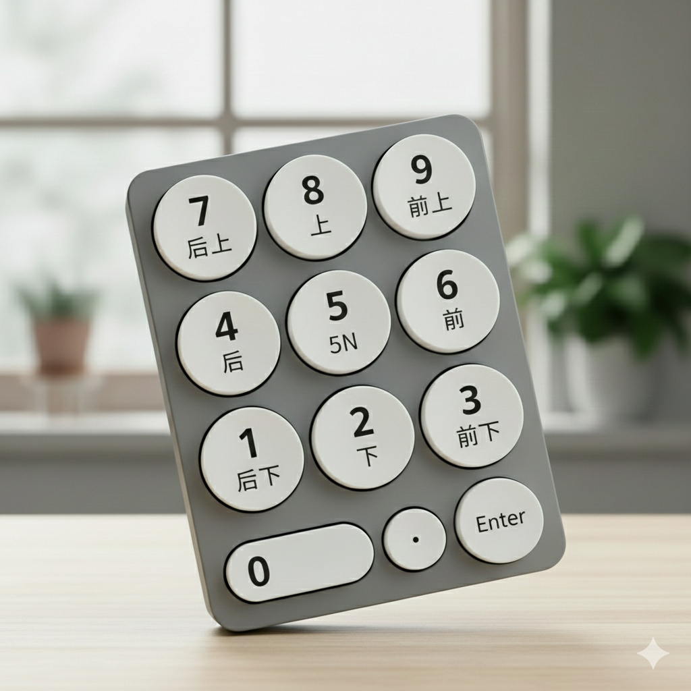

# 街霸6基础概念解析

# 街霸6基础概念解析

《街霸6》作为系列最新作品，在保留经典格斗元素的同时，引入了全新的斗气系统，并提供了多种操作模式以适应不同水平的玩家。以下是游戏的核心概念解析：

## 一、操作模式选择

游戏提供三种操作模式：

**经典模式**：传统6键操作，需要搓招输入，操作上限高但学习成本大，适合有格斗游戏经验的玩家。

**现代模式**：简化操作，将6键精简为3键，通过方向键组合实现一键出招和自动连招，出招伤害为经典模式的80%，适合新手快速上手。

**动感模式**：极简操作，AI会自动选择行动，适合完全零基础的玩家。

## 二、核心系统：斗气系统

斗气系统是《街霸6》最核心的资源管理机制，每个角色拥有6格斗气槽，对战开始时满槽，使用后会缓慢恢复。

### 主要斗气技能：

**斗气迸放（DI）** ：HP+HK，消耗1格斗气，拥有霸体效果，可接住对手攻击并反击，版边命中可触发撞墙效果。

**斗气招架（蓝防）** ：MP+MK，可格挡所有打击和飞行道具，持续消耗斗气。完美招架（精防）可在攻击来临前瞬间触发，使对手进入慢动作并增加反击时间。

**斗气前冲（绿冲）** ：斗气招架后66或可取消的普通技后66，前者消耗1格，后者消耗3格。绿冲命中或被防御时，我方获得+4帧有利帧。

**斗气必杀（OD技能）** ：同时按2个攻击键，消耗2格斗气，强化必杀技性能。

**斗气反击**：防御时6+HP+HK，消耗2格斗气，将对手弹开，版边可触发弹墙效果。

## 三、基础术语

### 方向与按键表示

使用数字小键盘表示方向：6\=前，4\=后，2\=下，8\=上，1\=后下，3\=前下，7\=后上，9\=前上。

攻击按键：LP\=轻拳，MP\=中拳，HP\=重拳，LK\=轻脚，MK\=中脚，HK\=重脚。

### 帧数概念

游戏1秒\=60帧，每个动作分为：前摇（发生帧）、命中判定、后摇（收招帧）。

**有利帧**：对手被打中后的硬直时间减去我方收招时间，决定能否继续连招。例如杰米重推掌打倒对手后有42帧硬直差。

**打康（Counter Hit）** ：在对手攻击发生或持续时命中，+2帧有利，造成1.2倍伤害。

<i class="fas fa-lightbulb"></i> 提示

**打康（Counter Hit）不是指防御成功，而是指在对手出招过程中成功命中对手。**

具体来说，打康发生在以下两种情况：

1. **对手正在出招时**：你比对手更快出招，在对手的攻击还没打出来之前就命中他
2. **对手攻击持续时**：对手的攻击已经打出来了，但在攻击动作还没结束前，你成功命中他

**打康的效果**：

- 屏幕会显示"Counter Hit"字样
- 造成1.2倍伤害（比正常命中多20%）
- 对手的受创硬直时间增加2帧，让你更容易接后续连招

**举例说明**：

如果对手出重拳（发生5帧），你在第3帧就出轻拳（发生3帧）命中他，这就是打康。因为你的攻击比对手更快，在他还没打到你之前就命中了。

**与防御的区别**：

- 防御：对手攻击你时你拉后，挡住攻击
- 打康：对手攻击你时，你出招比他快，在他打到你之前先打中他

所以打康不是防御成功，而是​**主动进攻成功打断了对手的攻击**。

**确反康（Punish Counter）** ：在对手收招硬直时命中，+4帧有利，造成1.2倍伤害。

<i class="fas fa-circle-info"></i> 说明

**确反康（Punish Counter）确实是在对手出招的收招后摇期间命中对方，但需要先防御或闪避对手的攻击。**

**确反康的触发条件：**

确反康发生在​**对手攻击动作的收招硬直阶段**（蓝色帧数部分）。具体来说，当对手的攻击被防御或闪避后，会进入收招硬直状态，此时命中对手就会触发确反康。屏幕会显示“Punish Counter”字样，造成 1.2 倍伤害，并额外增加 4 帧有利帧。

**与打康的区别：**

**打康（Counter Hit）** 是在对手攻击的**发生前摇或持续攻击阶段**命中对方，造成 1.2 倍伤害并 +2 帧有利帧；而**确反康**是在对手**收招后摇阶段**命中，+4 帧有利帧，硬直时间更长。

**实战应用：**

确反康是格斗游戏中的重要惩罚手段。例如，对手使用升龙拳等收招硬直较大的招式，被防御后会出现长时间破绽，此时使用重攻击打出确反康，可以形成长时间的受创硬直，便于接续高伤害连段。

在街霸 6 中，用重攻击打出确反康可以使对手进入长时间的受创硬直状态，即使本来不能取消的重攻击，也可以等自己收招之后再进行追击，形成一套收割连段。

## 四、连招系统

### 取消机制

**取消连**​：在招式A的命中判定阶段（A阶段）输入招式B，取消A的收招硬直。包括普通技\>必杀技、TC技、轻攻击连打等。

**目押连**​：在招式A的收招硬直（R阶段）结束后输入招式B，需要节奏感。例如2HP\>2MP。

### 取消时机

在训练模式中开启"取消时机显示"，角色身体变红时即为取消时机。不同招式的取消窗口不同，重攻击通常比轻攻击的取消窗口更宽松。

## 五、防御与反击

**投技**：LP+LK，无视防御，发生5帧。对手在防御硬直和受击硬直结束后有2帧对投无敌，起身后有1帧对投无敌。

**安全跳**：利用跳跃攻击的收招时间差，使对手即使凹升龙也无法命中。例如杰米重推掌后前跳攻击，对手只有4帧可以打到我们，而标准OD升龙需要6帧发生，因此打不中。

**确反**：在对手攻击收招硬直时进行反击，需要熟悉各招式的帧数数据。

## 六、游戏模式

**环球游历**：单人RPG模式，主线约16-17小时，可作为新手教学，通过拜师系统学习各角色的招式。

**斗技战场**：包含排位赛、休闲赛、战队赛等多种对战模式。

**极限对抗**：特殊规则和机关的战斗模式，氛围轻松。

## 七、实战建议

1. **新手建议**：从现代模式开始，熟悉基础操作后再考虑转经典模式。
2. **资源管理**：合理使用斗气槽，避免过度消耗导致虚损状态。
3. **练习方法**：在训练模式中开启帧数表和取消时机显示，反复练习连招形成肌肉记忆。
4. **立回意识**：格斗游戏不仅是连招，更重要的是立回（距离控制、心理博弈、择攻防）。

《街霸6》虽然系统复杂，但通过系统学习和持续练习，任何玩家都能体验到格斗游戏的乐趣。建议从简单连招开始，逐步提升操作水平。

‍
